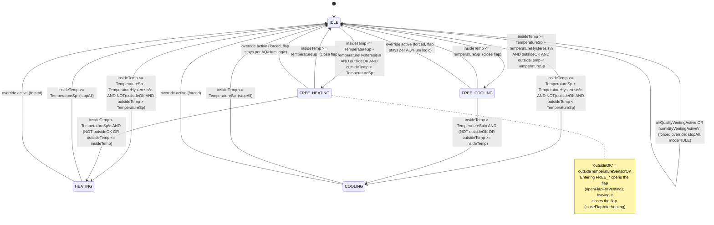

# Close Room Environment Control — Source Code Overview

This document describes every source file in `src/` and explains the
conditional logic that drives the climate-control system, including a
state-transition diagram for the core HVAC state machine.

## 1. Entry point & shared state

**`main.cpp`**
Arduino entry point (`setup()` / `loop()`). Configures every GPIO pin (relays,
MOSFET PWM channels, fan, servo), runs the flap self-test, initializes all
sensors (inside/outside BMP180, MQ135, DHT11, current sensor), brings up the
WiFi access point, and registers the HTTP routes (`/`, `/status`, `/set`,
`/notaus`, `/login`). `loop()` calls `server.handleClient()` and
`runControlLoop()`.

**`global.cpp`**
Defines and initializes every shared global variable declared `extern` in
`config.h`: setpoints (`TemperatureSp`, `TemperatureHysteresis`, `airQualitySp`,
`airQualityHysteresis`, `humiditySp`), actuator levels (`peltierPower`,
`fanPower`), live readings (`insideTemp`, `insidePressure`, `outsideTemp`,
`currentHumidity`, `currentAmps`, `mq135Raw`), sensor-health flags
(`insideTemperatureSensorOK`, `airQualitySensorOK`, `humiditySensorOK`,
`outsideTemperatureSensorOK`), mode/venting flags (`currentMode`,
`thermalVentingActive`, `airQualityVentingActive`, `humidityVentingActive`,
`flapOpen`), the safety/login flags (`emergencyStop`, `settingsLoggedIn`,
`settingsPassword`), timing variables, and shared hardware objects
(`bmpInside`, `bmpOutside`, `server`, `flapServo`, AP credentials).

**`config/config.h`**
Central header declaring all pin assignments, the `Mode` enum
(`IDLE, HEATING, COOLING, FREE_COOLING, FREE_HEATING`), the setpoint
min/max bounds (`TemperatureSp_MIN/MAX`, `AirqualitySp_MIN/MAX`,
`HumiditySp_MIN/MAX`), and `extern` declarations for every global in
`global.cpp`. Included almost everywhere as the shared-state contract.

## 2. Control layer

**`control/control.h` / `control/control.cpp`**
Implements `runControlLoop()`, the per-iteration orchestration function. It
always services the NOT-AUS button and status LEDs first; if `emergencyStop`
is set it returns immediately (suspending all control). Otherwise it applies
pending relay/PWM transitions and, once per `SENSOR_INTERVAL`, reads all
sensors, runs the air-quality and humidity venting handlers, and finally
calls `runStateMachine()`.

**`control/statemachine/statemachine.cpp` / `.h`**
Implements `runStateMachine()` — the core HVAC mode controller — and
`stopAll()` (zeroes Peltier/fan PWM, opens both relays). Contains the
`IDLE / HEATING / COOLING / FREE_COOLING / FREE_HEATING` transition logic plus
an override branch that suspends temperature control whenever air-quality or
humidity venting is active. Helper statics `openFlapForVenting()` /
`closeFlapAfterVenting()` manage the flap and `thermalVentingActive` for the
FREE_* states. Full transition diagram in section 4.

**`control/element/Sensor_Reading/Sensor_Reading.cpp` / `.h`**
Implements `sensorDue()` (true once `SENSOR_INTERVAL` has elapsed) and
`readSensor()`, which reads the inside BMP180 temperature/pressure, validates
plausibility (`insideTemperatureSensorOK`), reads the MQ135 raw value
(validating `airQualitySensorOK`), and logs a consolidated status line.

**`control/element/AirQuality/AirQuality.cpp` / `.h`**
Implements `handleAirQuality()`: opens the flap and turns on the ventilation
fan (`airQualityVentingActive = true`) when `mq135Raw > airQualitySp`, and
closes them again once the reading drops below
`airQualitySp - airQualityHysteresis` — provided no other venting condition
still needs the flap open. This is the highest-priority venting source.

**`control/element/HumiditySensor/HumiditySensor.cpp` / `.h`**
Implements `initHumiditySensor()`, `readHumiditySensor()` (sets
`humiditySensorOK = false` on a failed/NaN read), and
`handleHumiditySensor()`, which opens the flap + fan when
`currentHumidity > humiditySp` and closes them again once humidity drops
below `humiditySp - 5.0`, gated by the same "don't close while another
venting condition is active" rule.

**`control/element/OutsideTemperatureSensor/OutsideTemperatureSensor.cpp` / `.h`**
Manages the second BMP180 on the ESP32's secondary I2C bus (`Wire1`, to avoid
an address clash with the inside sensor). `initoutsideTemperatureSensor()`
sets `outsideTemperatureSensorOK`; `readoutsideTemperatureSensor()` refreshes
`outsideTemp` / `outsidePressure` each cycle if the sensor is OK.

**`control/element/Petelier_Polarity/Petelier_Polarity.cpp` / `.h`**
Manages the delayed relay/PWM switchover for the Peltier element and fans.
`startModeChange(heating, pwmValue, fanValue)` zeroes the Peltier PWM and
schedules the change; `handlePendingRelay()` waits `RELAY_DELAY` ms, flips the
heating/cooling relay, applies the Peltier PWM (with a brief full-power
"kick-start"), and starts the fans.

**`control/element/CurrentSensor/CurrentSensor.cpp` / `.h`**
Implements `calibrateCurrentSensor()` (averages ADC samples with no load to
find the ACS712's zero-current point, falling back to a default if implausible)
and `handleCurrentSensor()` (converts the deviation from the zero point into
amps, stored in `currentAmps`).

**`control/element/HardwareIO/HardwareIO.cpp` / `.h`**
Provides `initHardwareIO()` (status LEDs, NOT-AUS relay and button),
`updateStatusLEDs()` (mirrors `currentMode` / `emergencyStop` onto the LEDs
and the NOT-AUS relay), and `readNotAusButton()` (debounced button handler
that toggles `emergencyStop`, forcing all outputs off and `currentMode = IDLE`
when entering emergency stop).

## 3. Web layer

**`web/webhandler/webhandler.cpp` / `.h`**
Defines the page shell (`SHELL_HTML` / `SHELL_HTML_END` — CSS, nav bar,
NOT-AUS styling, sensor-alert banner, login overlay) and implements:
- `handleRoot()` — assembles and serves the full page (shell + dashboard +
  settings fragments).
- `handleNotAus()` — the `/notaus` route; toggles `emergencyStop` and returns
  `{"emergency": <bool>}`.
- `handleLogin()` — the `/login?pass=...` route; checks the password against
  `settingsPassword`, sets `settingsLoggedIn`, and returns `{"ok": <bool>}`.

**`web/dashboard/dashboard.cpp` / `.h`**
Defines `DASHBOARD_HTML` (mode box, NOT-AUS button, live metric tiles,
setpoint/air-quality/humidity input cards, sensor-error alert banner) and its
embedded JS, which polls `/status`, updates all live values, drives the
NOT-AUS toggle and the login overlay, clamps setpoint inputs to their
min/max bounds, and shows the sensor-error popup. Implements `handleStatus()`,
the `/status` JSON handler exposing `temp, pressure, insideOK, current,
outsideTemp, outsideOK, mq135, aqOK, humOK, aqLimit, aqHyst, humidity,
humLimit, sp, delta, peltierPower, fanPWM, mode, emergency`.

**`web/settings/settings.cpp` / `.h`**
Defines `SETTINGS_HTML` (hysteresis fields, Peltier/fan power sliders, power
presets) and implements `handleSet()`, the `/set` handler: reads optional
query args (`sp`, `delta`, `peltierPower`, `fanPWM`, `aqLimit`, `aqHyst`,
`humLimit`), clamps `sp` / `aqLimit` / `humLimit` to their configured
min/max bounds, applies PWM live if currently heating/cooling, and returns
the updated values as JSON.

## 4. HVAC state machine — `runStateMachine()`

States: `IDLE`, `HEATING`, `COOLING`, `FREE_COOLING`, `FREE_HEATING`.

### Override layer (checked first, every cycle)

```
overrideActive = airQualityVentingActive OR humidityVentingActive
```

When `overrideActive` becomes true, the machine immediately calls `stopAll()`,
clears `thermalVentingActive`, forces `currentMode = IDLE`, and **returns** —
all normal transitions below are skipped until venting ends. When it ends,
control resumes evaluating from `IDLE`.

### Diagram



### Transition list (plain text)

- **IDLE → FREE_HEATING**: `insideTemp <= TemperatureSp - TemperatureHysteresis` AND `outsideTemperatureSensorOK` AND `outsideTemp > TemperatureSp` → open flap, `thermalVentingActive = true`
- **IDLE → HEATING**: same cold condition, but outside sensor not OK or outside not warmer than setpoint → start Peltier heating
- **IDLE → FREE_COOLING**: `insideTemp >= TemperatureSp + TemperatureHysteresis` AND `outsideTemperatureSensorOK` AND `outsideTemp < TemperatureSp` → open flap
- **IDLE → COOLING**: same hot condition, but outside sensor not OK or outside not cooler than setpoint → start Peltier cooling
- **HEATING → IDLE**: `insideTemp >= TemperatureSp` → `stopAll()`
- **COOLING → IDLE**: `insideTemp <= TemperatureSp` → `stopAll()`
- **FREE_HEATING → IDLE**: `insideTemp >= TemperatureSp` → close flap, clear venting
- **FREE_HEATING → HEATING**: setpoint not yet reached AND (`!outsideTemperatureSensorOK` OR `outsideTemp <= insideTemp`) → close flap, fall back to Peltier heating
- **FREE_COOLING → IDLE**: `insideTemp <= TemperatureSp` → close flap, clear venting
- **FREE_COOLING → COOLING**: setpoint not yet reached AND (`!outsideTemperatureSensorOK` OR `outsideTemp >= insideTemp`) → close flap, fall back to Peltier cooling
- **Any state → IDLE (forced)**: `airQualityVentingActive OR humidityVentingActive` becomes true → `stopAll()`, clear `thermalVentingActive`, force IDLE, and hold there until venting ends

## 5. Other significant conditional logic

### Air-quality venting (`AirQuality.cpp`)
- **ON**: `mq135Raw > airQualitySp` AND not already venting → open flap, fan ON, `airQualityVentingActive = true`
- **OFF**: `mq135Raw < airQualitySp - airQualityHysteresis` AND currently venting → clear flag; physically close flap/fan only if `!thermalVentingActive AND !humidityVentingActive`

### Humidity venting (`HumiditySensor.cpp`)
- **ON**: `currentHumidity > humiditySp` AND not already venting → open flap, fan ON, `humidityVentingActive = true`
- **OFF**: `currentHumidity < humiditySp - 5.0` AND currently venting → clear flag; physically close flap/fan only if `!airQualityVentingActive AND !thermalVentingActive`
- Net effect: the shared flap only physically closes once **all three** venting flags (`airQuality`, `humidity`, `thermal`) are false.

### Sensor health checks
- **Inside BMP180**: `insideTemperatureSensorOK = !isnan(t) && !isnan(p) && t∈(-40,85) && p∈(300,1100)`
- **MQ135**: `airQualitySensorOK = !(mq135Raw == 0 || mq135Raw >= 4000)`
- **DHT11 humidity**: `humiditySensorOK = false` on a NaN read, `true` otherwise
- **Outside BMP180**: `outsideTemperatureSensorOK` set at init time from `bmpOutside.begin()`
- **Current sensor**: calibration validates the zero-point raw ADC reading is within `[500, 3800]`, else falls back to a default of `2048`
- All four sensor flags are surfaced in `/status` JSON (`insideOK`, `outsideOK`, `aqOK`, `humOK`) and consumed by the dashboard's JS, which builds and shows a popup naming every sensor currently in error.

### Login / Settings-unlock flow
- **Client (dashboard JS)**: a single nav button shows "Login" while locked; submitting the password calls `GET /login?pass=...`. On `{"ok":true}` it unlocks the Settings page and relabels the button "⚙ Settings"; on `{"ok":false}` it shows "Wrong password".
- **Server (`handleLogin`)**: compares the supplied password to `settingsPassword` (default `"admin"`), sets `settingsLoggedIn`, and returns `{"ok": <bool>}`.
- **NOT-AUS**: `/notaus` (web) and the physical button (`HardwareIO.cpp`) both toggle the same `emergencyStop` flag — entering emergency stop forces all outputs off and `currentMode = IDLE`.
