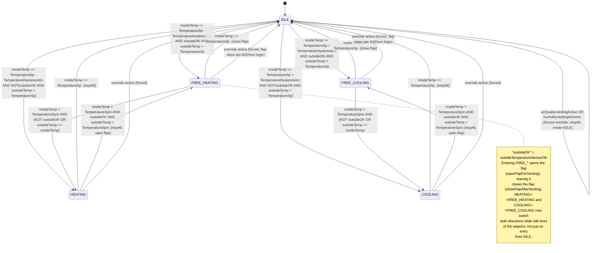

# Close Room Environment Control — Source Code Overview

This document describes every source file in `src/` and explains the
conditional logic that drives the climate-control system, including a
state-transition diagram for the core HVAC state machine.

> **HVAC** = **H**eating, **V**entilation, and **A**ir **C**onditioning —
> the standard term for a system that controls a space's temperature and air
> quality. This project covers all three: heating and cooling via the Peltier
> element, and ventilation via the servo flap and fans.

## 1. Entry point & shared state

**`main.cpp`**
Arduino entry point (`setup()` / `loop()`). Configures every GPIO pin (relays,
MOSFET PWM channels, air-quality fan, servo), runs the flap self-test,
initializes the inside/outside BMP180, MQ135, and DHT11 sensors, brings up the
WiFi access point, registers the HTTP routes (`/`, `/status`, `/set`,
`/notaus`, `/login`), and calibrates the current sensor last — after
`server.begin()` — so the ADC is fully warmed up and all rails are stable.
`loop()` calls `server.handleClient()` and `runControlLoop()`.

**`global.cpp`**
Defines and initializes every shared global variable declared `extern` in
`config.h`: setpoints (`TemperatureSp`, `TemperatureHysteresis`, `airQualitySp`,
`airQualityHysteresis`, `humiditySp`), actuator levels (`peltierPower`,
`fanPower`), live readings (`insideTemp`, `insidePressure`, `outsideTemp`,
`currentHumidity`, `currentAmps`, `mq135Raw`), sensor-health flags
(`insideTemperatureSensorOK`, `airQualitySensorOK`, `humiditySensorOK`,
`outsideTemperatureSensorOK`), mode/venting flags (`currentMode`,
`thermalVentingActive`, `airQualityVentingActive`, `humidityVentingActive`,
`flapOpen`), the safety/login flags (`emergencyStop`, `settingsLoggedIn`,
`settingsPassword`), timing variables, and shared hardware objects
(`bmpInside`, `bmpOutside`, `server`, `flapServo`, AP credentials).

**`config/config.h`**
Central header declaring all pin assignments, the `Mode` enum
(`IDLE, HEATING, COOLING, FREE_COOLING, FREE_HEATING`), the setpoint
min/max bounds (`TemperatureSp_MIN/MAX`, `AirqualitySp_MIN/MAX`,
`HumiditySp_MIN/MAX`), and `extern` declarations for every global in
`global.cpp`. Included almost everywhere as the shared-state contract. The
NOT-AUS path is button-only (`NotAusButton_PIN`) — there is no NOT-AUS relay.
Status LEDs are just `LED_HEATING_PIN`, `LED_COOLING_PIN`, and `LED_READY_PIN`
(no separate "free venting" LED — see `HardwareIO.cpp` below).

## 2. Control layer

**`control/control.h` / `control/control.cpp`**
Implements `runControlLoop()`, the per-iteration orchestration function. It
always services the NOT-AUS button and status LEDs first; if `emergencyStop`
is set it returns immediately (suspending all control). Otherwise it applies
pending relay/PWM transitions and, once per `SENSOR_INTERVAL`, reads all
sensors, runs the air-quality and humidity venting handlers, and finally
calls `runStateMachine()`.

**`control/statemachine/statemachine.cpp` / `.h`**
Implements `runStateMachine()` — the core HVAC mode controller — and
`stopAll()` (zeroes Peltier/fan PWM, opens both relays). Contains the
`IDLE / HEATING / COOLING / FREE_COOLING / FREE_HEATING` transition logic,
including bidirectional switching between active (Peltier) and free
(flap-only) modes whenever outside conditions cross the setpoint while still
short of it — plus an override branch that suspends temperature control
whenever air-quality or humidity venting is active. Helper statics
`openFlapForVenting()` / `closeFlapAfterVenting()` manage the flap and
`thermalVentingActive` for the FREE_* states. Full transition diagram in
section 4.

**`control/element/Sensor_Reading/Sensor_Reading.cpp` / `.h`**
Implements `sensorDue()` (true once `SENSOR_INTERVAL` has elapsed) and
`readSensor()`, which reads the inside BMP180 temperature/pressure, validates
plausibility (`insideTemperatureSensorOK`), reads the MQ135 raw value
(validating `airQualitySensorOK`), and logs a consolidated status line
(including the live current reading, `currentAmps`).

**`control/element/AirQuality/AirQuality.cpp` / `.h`**
Implements `handleAirQuality()` (skipped entirely if `!airQualitySensorOK`):
opens the flap and switches the relay-driven air-quality fan (`AirQualityFanPin`)
on when `mq135Raw > airQualitySp`, setting `airQualityVentingActive = true`.
Once the reading drops below `airQualitySp - airQualityHysteresis`, the fan
turns off unconditionally, but the flap only physically closes if no other
venting condition (`thermalVentingActive` / `humidityVentingActive`) still
needs it open. This is the highest-priority venting source.

**`control/element/HumiditySensor/HumiditySensor.cpp` / `.h`**
Implements `initHumiditySensor()`, `readHumiditySensor()` (sets
`humiditySensorOK = false` on a failed/NaN read), and
`handleHumiditySensor()`, which opens the flap + fan when
`currentHumidity > humiditySp` and closes them again once humidity drops
below `humiditySp - 5.0`, gated by the same "don't close while another
venting condition is active" rule — unlike `AirQuality.cpp`, here the fan
*and* the flap are closed together as one gated block.

**`control/element/OutsideTemperatureSensor/OutsideTemperatureSensor.cpp` / `.h`**
Manages the second BMP180 on the ESP32's secondary I2C bus (`Wire1`, to avoid
an address clash with the inside sensor). `initoutsideTemperatureSensor()`
sets `outsideTemperatureSensorOK`; `readoutsideTemperatureSensor()` refreshes
`outsideTemp` / `outsidePressure` each cycle if the sensor is OK.

**`control/element/Petelier_Polarity/Petelier_Polarity.cpp` / `.h`**
Manages the delayed relay/PWM switchover for the Peltier element and fans.
`startModeChange(heating, pwmValue, fanValue)` zeroes the Peltier PWM and
schedules the change; `handlePendingRelay()` waits `RELAY_DELAY` ms, flips the
heating/cooling relay, and applies the Peltier PWM. Both fan channels then go
straight to full speed (255). If the target fan PWM is below 255, that's a
deliberate 1-second "kick-start" before settling down to the target; if the
target is already 255, the fans simply stay there.

**`control/element/CurrentSensor/CurrentSensor.cpp` / `.h`**
Implements `calibrateCurrentSensor()` and `handleCurrentSensor()` for the
ACS712 sensor, read through a 2/3 voltage divider into GPIO35 using
`analogReadMilliVolts()` for the ESP32's built-in ADC linearity correction.
Calibration averages 500 samples (after a 200-sample warmup) and only accepts
the zero-point reading if it falls within `[1200, 2000]` mV, setting
`acsPowered = true`; otherwise the sensor is treated as not-yet-powered and
`zeroMV` keeps its 1667 mV default (2.5 V × 2/3) until a later successful
calibration. `handleCurrentSensor()` retries calibration on each call while
`!acsPowered`; once calibrated, it averages another 500 samples and computes
`currentAmps = |avgMV - zeroMV| / ACS_MV_PER_AMP` (empirically calibrated to
`125.9` mV/A — higher than the ~65 mV/A real sensor slope because of ESP32
ADC nonlinearity in this voltage range). If a live reading ever drops below
900 mV, VCC is assumed disconnected — `acsPowered` resets to `false` and
`currentAmps` reports `0` until the sensor is detected again.

**`control/element/HardwareIO/HardwareIO.cpp` / `.h`**
Provides `initHardwareIO()` (status LEDs and the NOT-AUS button — no relay),
`updateStatusLEDs()` (lights `LED_HEATING_PIN` for `HEATING` *or*
`FREE_HEATING`, `LED_COOLING_PIN` for `COOLING` *or* `FREE_COOLING`, and
drives `LED_READY_PIN` solid ON normally or blinking at ~2 Hz — toggling every
250 ms — while `emergencyStop` is active), and `readNotAusButton()` (debounced
button handler that toggles `emergencyStop`, forcing all outputs off and
`currentMode = IDLE` when entering emergency stop).

## 3. Web layer

**`web/webhandler/webhandler.cpp` / `.h`**
Defines the page shell (`SHELL_HTML` / `SHELL_HTML_END` — CSS, nav bar with
Dashboard / Presets / Login-Settings buttons, NOT-AUS styling, sensor-alert
banner, login overlay) and implements:
- `handleRoot()` — assembles and serves the full page (shell + dashboard +
  presets + settings fragments).
- `handleNotAus()` — the `/notaus` route; toggles `emergencyStop` and returns
  `{"emergency": <bool>}`.
- `handleLogin()` — the `/login?pass=...` route; checks the password against
  `settingsPassword`, sets `settingsLoggedIn`, and returns `{"ok": <bool>}`.

**`web/dashboard/dashboard.cpp` / `.h`**
Defines `DASHBOARD_HTML` (mode box, NOT-AUS button, live metric tiles —
Inside/Outside Temp, Pressure, Current, and a client-computed Supply Power —
setpoint/air-quality/humidity input cards, sensor-error alert banner) and its
embedded JS, which polls `/status`, updates all live values (Supply Power is
computed client-side as `current × 12 V`), drives the NOT-AUS toggle and the
login overlay, clamps setpoint inputs to their min/max bounds, and shows the
sensor-error popup. Implements `handleStatus()`, the `/status` JSON handler
exposing `temp, pressure, insideOK, current, outsideTemp, outsideOK, mq135,
aqOK, humOK, aqLimit, aqHyst, humidity, humLimit, sp, delta, peltierPower,
fanPWM, mode, emergency`.

**`web/settings/settings.cpp` / `.h`**
Defines `SETTINGS_HTML` (hysteresis fields, Peltier/fan power sliders) and
implements `handleSet()`, the `/set` handler: reads optional query args
(`sp`, `delta`, `peltierPower`, `fanPWM`, `aqLimit`, `aqHyst`, `humLimit`),
clamps `sp` / `aqLimit` / `humLimit` to their configured min/max bounds,
applies PWM live if currently `HEATING`/`COOLING`, and returns the updated
values as JSON.

**`web/presets/presets.cpp` / `.h`**
Defines `PRESETS_HTML`, a standalone page (separate from Settings) listing
four fixed power presets — Economic, Medium, Balanced, Full — each as a
button showing its approximate wattage and PWM split. Each button's
`applyPreset(peltierPWM, fanPWM)` updates the Settings sliders (if already in
the DOM) and posts directly to `/set?peltierPower=...&fanPWM=...`.

## 4. HVAC state machine — `runStateMachine()`

States: `IDLE`, `HEATING`, `COOLING`, `FREE_COOLING`, `FREE_HEATING`.

### Override layer (checked first, every cycle)

```
overrideActive = airQualityVentingActive OR humidityVentingActive
```

When `overrideActive` becomes true, the machine immediately calls `stopAll()`,
clears `thermalVentingActive`, forces `currentMode = IDLE`, and **returns** —
all normal transitions below are skipped until venting ends. When it ends,
control resumes evaluating from `IDLE`.

### Diagram



### Transition list (plain text)

- **IDLE → FREE_HEATING**: `insideTemp <= TemperatureSp - TemperatureHysteresis` AND `outsideTemperatureSensorOK` AND `outsideTemp > TemperatureSp` → open flap, `thermalVentingActive = true`
- **IDLE → HEATING**: same cold condition, but outside sensor not OK or outside not warmer than setpoint → start Peltier heating
- **IDLE → FREE_COOLING**: `insideTemp >= TemperatureSp + TemperatureHysteresis` AND `outsideTemperatureSensorOK` AND `outsideTemp < TemperatureSp` → open flap
- **IDLE → COOLING**: same hot condition, but outside sensor not OK or outside not cooler than setpoint → start Peltier cooling
- **HEATING → IDLE**: `insideTemp >= TemperatureSp` → `stopAll()`
- **HEATING → FREE_HEATING**: `insideTemp < TemperatureSp` AND `outsideTemperatureSensorOK` AND `outsideTemp > TemperatureSp` → `stopAll()`, open flap (outside alone can now finish the job)
- **COOLING → IDLE**: `insideTemp <= TemperatureSp` → `stopAll()`
- **COOLING → FREE_COOLING**: `insideTemp > TemperatureSp` AND `outsideTemperatureSensorOK` AND `outsideTemp < TemperatureSp` → `stopAll()`, open flap
- **FREE_HEATING → IDLE**: `insideTemp >= TemperatureSp` → close flap, clear venting
- **FREE_HEATING → HEATING**: setpoint not yet reached AND (`!outsideTemperatureSensorOK` OR `outsideTemp <= insideTemp`) → close flap, fall back to Peltier heating
- **FREE_COOLING → IDLE**: `insideTemp <= TemperatureSp` → close flap, clear venting
- **FREE_COOLING → COOLING**: setpoint not yet reached AND (`!outsideTemperatureSensorOK` OR `outsideTemp >= insideTemp`) → close flap, fall back to Peltier cooling
- **Any state → IDLE (forced)**: `airQualityVentingActive OR humidityVentingActive` becomes true → `stopAll()`, clear `thermalVentingActive`, force IDLE, and hold there until venting ends

**Design note — why entry and exit checks compare against different references:**
transitions *into* a FREE_* state (from `IDLE`, `HEATING`, or `COOLING`)
compare `outsideTemp` against `TemperatureSp` — "is outside air alone good
enough to fully reach the target, without the Peltier?" Transitions *out of*
a FREE_* state back to the Peltier compare `outsideTemp` against `insideTemp`
— "is outside still actively pushing the room temperature the right way,
right now?" These differ because `insideTemp` drifts toward `outsideTemp`
while venting; the two can converge or cross well before `TemperatureSp` is
reached, and the `insideTemp` check catches that stall immediately rather
than waiting for a large gap from the goal.

## 5. Other significant conditional logic

### Air-quality venting (`AirQuality.cpp`)
- Skipped entirely if `!airQualitySensorOK`.
- **ON**: `mq135Raw > airQualitySp` AND not already venting → open flap, relay-driven fan (`AirQualityFanPin`) ON, `airQualityVentingActive = true`
- **OFF**: `mq135Raw < airQualitySp - airQualityHysteresis` AND currently venting → clear flag, fan OFF unconditionally; flap physically closes only if `!thermalVentingActive AND !humidityVentingActive`

### Humidity venting (`HumiditySensor.cpp`)
- **ON**: `currentHumidity > humiditySp` AND not already venting → open flap, fan ON, `humidityVentingActive = true`
- **OFF**: `currentHumidity < humiditySp - 5.0` AND currently venting → clear flag; fan *and* flap close together, only if `!airQualityVentingActive AND !thermalVentingActive`
- Net effect: the shared flap only physically closes once **all three** venting flags (`airQuality`, `humidity`, `thermal`) are false.

### Sensor health checks
- **Inside BMP180**: `insideTemperatureSensorOK = !isnan(t) && !isnan(p) && t∈(-40,85) && p∈(300,1100)`
- **MQ135**: `airQualitySensorOK = !(mq135Raw == 0 || mq135Raw >= 4000)`
- **DHT11 humidity**: `humiditySensorOK = false` on a NaN read, `true` otherwise
- **Outside BMP180**: `outsideTemperatureSensorOK` set at init time from `bmpOutside.begin()`
- **Current sensor**: calibration validates the zero-point reading (via `analogReadMilliVolts()`) is within `[1200, 2000]` mV, else `acsPowered = false` and the sensor retries calibration on every subsequent cycle; a live reading below 900 mV is treated as VCC lost
- All four temperature/air/humidity sensor flags are surfaced in `/status` JSON (`insideOK`, `outsideOK`, `aqOK`, `humOK`) and consumed by the dashboard's JS, which builds and shows a popup naming every sensor currently in error.

### Login / Settings-unlock flow
- **Client (dashboard JS)**: a single nav button shows "Login" while locked; submitting the password calls `GET /login?pass=...`. On `{"ok":true}` it unlocks the Settings page and relabels the button "⚙ Settings"; on `{"ok":false}` it shows "Wrong password".
- **Server (`handleLogin`)**: compares the supplied password to `settingsPassword` (default `"admin"`), sets `settingsLoggedIn`, and returns `{"ok": <bool>}`.
- **NOT-AUS**: `/notaus` (web) and the physical button (`HardwareIO.cpp`) both toggle the same `emergencyStop` flag — entering emergency stop forces all outputs off, `currentMode = IDLE`, and the ready LED begins blinking.
